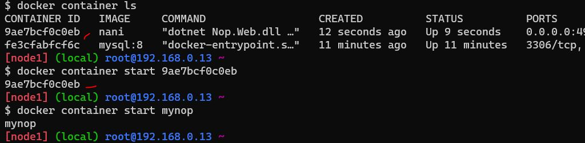

# Create a jenkins image by creating your own docker.
* $ vi dockerfile
```
FROM ubuntu:22.04
LABEL author="Supriya" organization="qt" project="learning"
RUN apt update && apt install openjdk-11-jdk maven curl -y
RUN curl -fsSL https://pkg.jenkins.io/debian-stable/jenkins.io-2023.key | tee \
    /usr/share/keyrings/jenkins-keyring.asc > /dev/null
RUN echo deb [signed-by=/usr/share/keyrings/jenkins-keyring.asc] \
    https://pkg.jenkins.io/debian-stable binary/ | tee \
    /etc/apt/sources.list.d/jenkins.list > /dev/null
RUN apt-get update && apt-get install jenkins -y
EXPOSE 8080
CMD ["/usr/bin/jenkins"]
```
Results
 ```
  $ docker image build -t jenkins .
  $ docker container run -d --name ubuntu -P jenkins
  $ docker container ls
 ```
 * 
Open the port that have given (49513)
 *   
  Login into jenkins
  
  
  
* Jenkins will getting started
* 
* 
* 


# Create nop commerce and mysql server container and try to make them work by configure

* 1. create network
    $ docker network
    $ docker network create -d bridge --subnet "10.0.0.0/24" mysqlnetwork
    
* 2. create volume
     $  docker volume create sqlvolume
     
* 3. create sql (container)
   $ docker container run -d --name sqldb -v MYVOL:/var/libsqldb --network mysqlnetwork -e MYSQL_USER=supriya -e MYSQL_ROOT_PASSWORD=nani123 -e MYSQL_DATABASE=employees -e -P mysql:8
   
* 4. create npo commerse docker file
  $ vi docker (write dockerfile)
  ```
  FROM mcr.microsoft.com/dotnet/sdk:7.0
  LABEL author="Prakash" organization="qt" project="learning"
  ADD https://github.com/nopSolutions/nopCommerce/releases/download/release-4.60.2/nopCommerce_4.60.2_NoSource_linux_x64.zip /nop/nopCommerce_4.60.2_NoSource_linux_x64.zip
  WORKDIR /nop
  RUN apt update && apt install unzip -y && \
    unzip /nop/nopCommerce_4.60.2_NoSource_linux_x64.zip && \
    mkdir /nop/bin && mkdir /nop/logs
  EXPOSE 5000
  CMD [ "dotnet", "Nop.Web.dll","--urls", "http://0.0.0.0:5000" ]
  ```
  $  docker container run -d --name mynop -P --network mysqlnetwork -e MTSQL_SERVER=sqldb nani
  $ docker container ls
  
open the port 

install

after install web will be get slow down , we have restart the web page
$ docker container start "container id/container name"

Final Results

