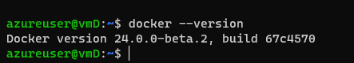
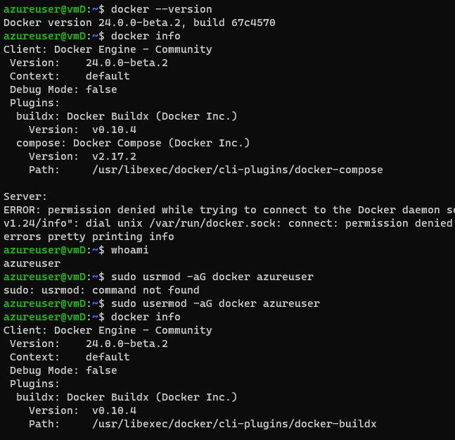

# Docker
Docker : Docker is an open source platform that enables developers to build, deploy, run, update and manage containers
* create a virtual michine with 8080 port
* login into terminal
* [ref here](https://www.google.com/search?q=install+docker+script+ubuntu&rlz=1C1VDKB_enIN953IN953&oq=install+docker+script+in+u&aqs=chrome.1.69i57j0i22i30j0i390i650l4.14845j0j7&sourceid=chrome&ie=UTF-8)
* 
  ```
   $ curl -fsSL https://test.docker.com -o test-docker.sh
   $ sh test-docker.sh
  ```
* 
* 
* $ exit
* then again login to the machine
* $ docker info 
* 
* Docker allows communication to the unix socket for the users who belong to docker group. so lets add current user to docker group sudo usermod -aG docker <username>. logout and login
* note : in one instance we can create many containers in a perticular storage
* -d :In the context of a Dockerfile , it means that same. Both inside and outside the image. Here the . means the current working directory, where the docker build command is executed. 
* -it :A Docker container image is a lightweight, standalone, executable package of software that includes everything needed to run an application: code, runtime, system tools, system libraries and settings.
results
* sleep 1 d -: it will detect the resource after one day
* exec :- docker container exec will allow us to execute commands in the container
* (-t) : it is used to tag the new image