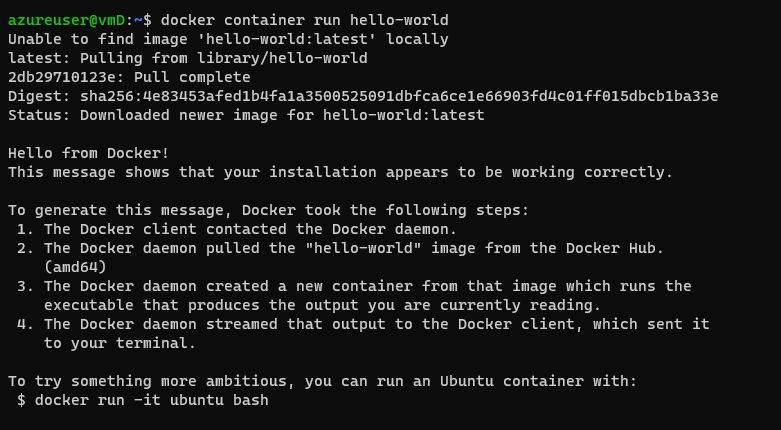
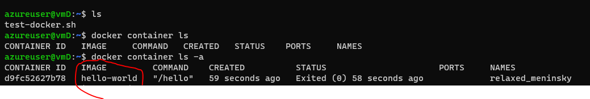
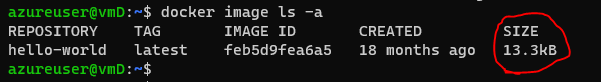
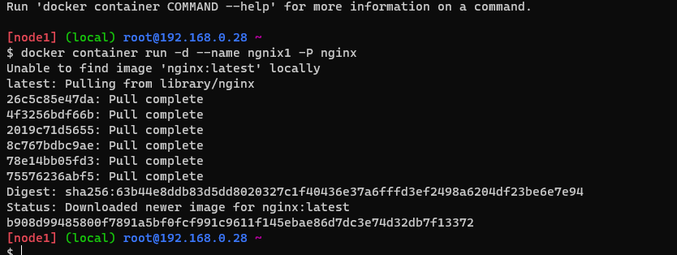
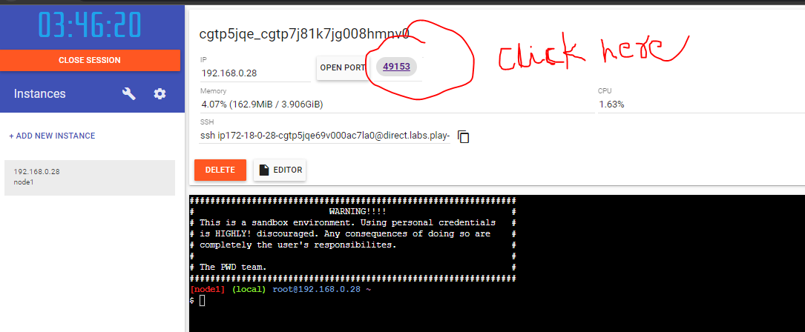

# Docker workbook - 1
* 1. run hello world in docker container and observe the container status
* 
* to check the status
* 
* 2. check the docker image and also write down the size hello-world image
* 
* 3. run the nginx container with name as nginx1 and expose it on 8080 port on docker host 
* 
```
$ docker container run -d --name ngnix1 -P nginx
```
* 
Results
* 


