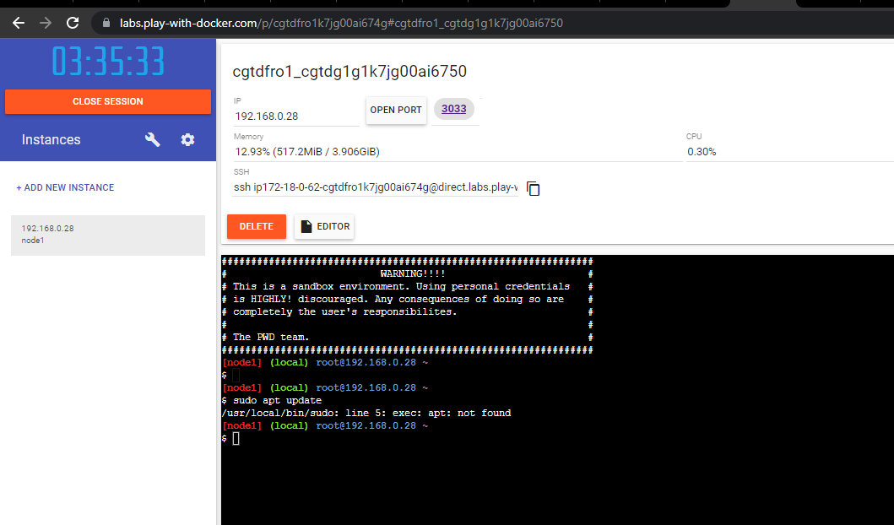
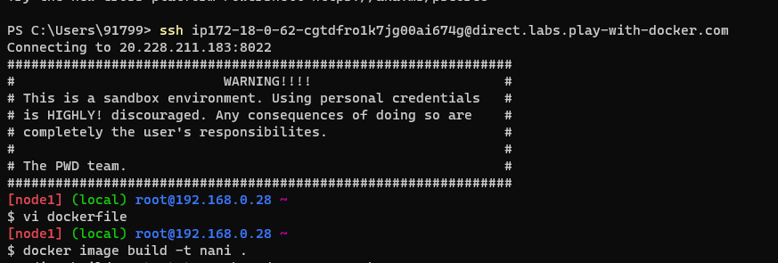
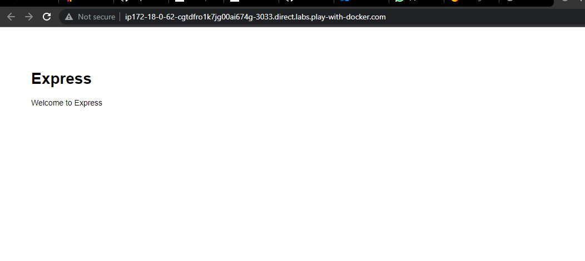

# Docke2 workbook - 1
* # https://github.com/expressjs/express 
Nodejs <= 0.10
Npm
git
steps in Dockerfile
1. FROM (base image) ubuntu or nodejs
2. need to add prerequests (Run command)
3. clone repo
4. cd express
5. npm install express
6. npm install -g express-generator@4
7. express /tmp/foo && cd /tmp/foo
8. npm install
9. Expose 3000
10. workdir /tmp/foo
10. npm start (CMD ['npm', 'start'])
# ( enetry point ==> which will execu first when container start)
expressjs/express
Fast, unopinionated, minimalist web framework for node.
Website
https://expressjs.com
Stars
60562
Added by GitHub

expressjs.comexpressjs.com
Express - Node.js web application framework (27 kB)
# https://github.com/expressjs/express
# prerequests
Nodejs <= 0.10
Npm
git
steps in Dockerfile
1. FROM (base image) ubuntu or nodejs
2. need to add prerequests (Run command)
3. clone repo
4. cd express
5. npm install express
6. npm install -g express-generator@4
7. express /tmp/foo && cd /tmp/foo
8. npm install
9. Expose 3000
10. workdir /tmp/foo
10. npm start (CMD ['npm', 'start'])
# ( enetry point ==> which will execu first when container start)
expressjs/express
Fast, unopinionated, minimalist web framework for node.
Website
https://expressjs.com
Stars
60562
Added by GitHub

expressjs.comexpressjs.com
Express - Node.js web application framework (27 kB)
[ref here](https://expressjs.com/)

* Steps - :
* 1. we have to login in treminal from docker playground
* [ref here](https://labs.play-with-docker.com/p/cgtdrko1k7jg00ai67tg)
* 
* 
Commands
```
$ vi dockerfile
$ docker image build -t "any name" .
$docker images
$ docker run -d -p 3033:3000 "any name"
``` 
We got the results
 
Note :- (-t) : it is used to tag the new image
 

