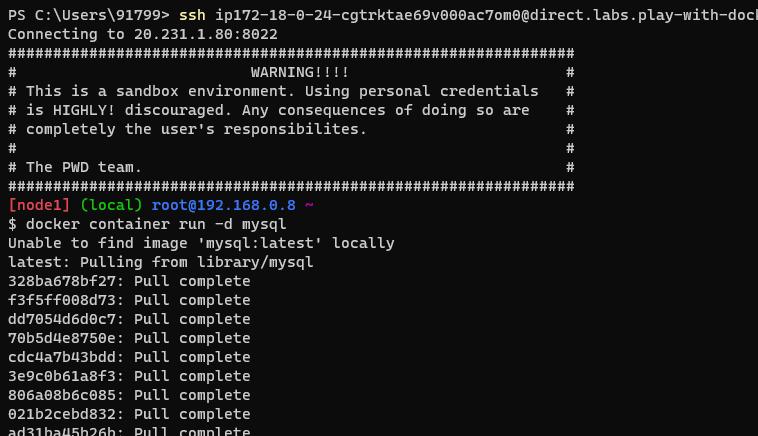
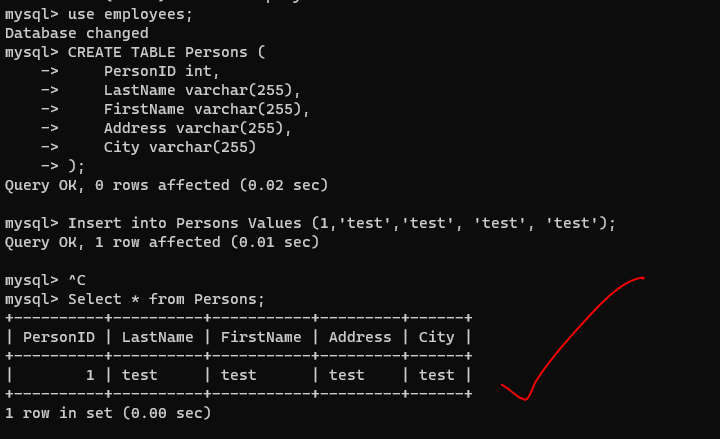
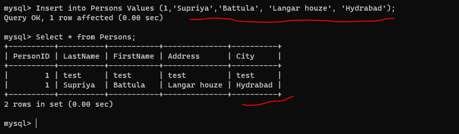

# Docke2 workbook - 3
* run mysql in docker container
```
$  docker container run -d mysql
```
* 
* create a table in mysql
```
$ docker container run -d --name mysqldb -e MYSQL_ROOT_PASSWORD=rootroot -e MYSQL_DATABASE=employees -e MYSQL_USER=qtdevops -e MYSQL_PASSWORD=rootroot -P mysql:8
```
* To login into container
  ```
  $ docker container exec -it mysqldb mysql --password=rootroot
  ```
* to create atable
```
$ use employees;
$ CREATE TABLE Persons (
    PersonID int,
    LastName varchar(255),
    FirstName varchar(255),
    Address varchar(255),
    City varchar(255)
);
$ Insert into Persons Values (1,'test','test', 'test', 'test');
$ Select * from Persons;
```
* Restuls
* 
* Add more rows
* 
* now exit the mysql
* $ exit
  