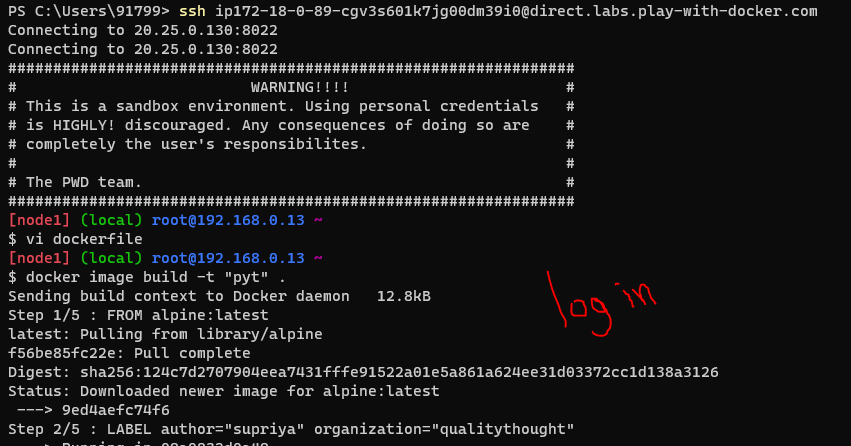
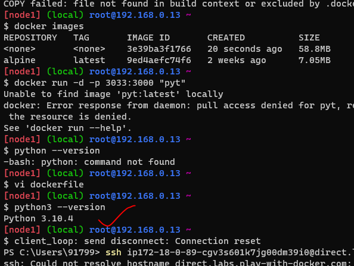
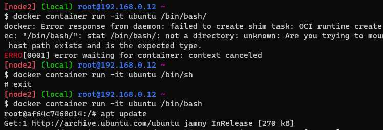
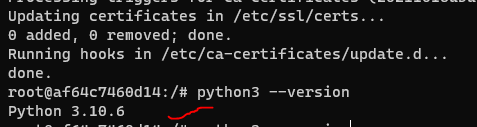
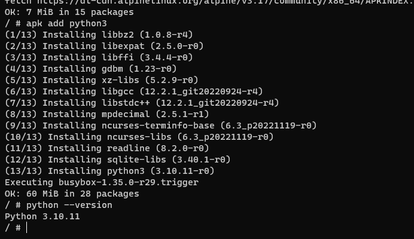

# workbook - 2 (18/04/23)
* 1. Create an alpine container in interactive mode and install python
```
FROM alpine:latest
LABEL author="supriya" organization="qualitythought"
RUN apk --update add python3
COPY hello-docker.py /opt/
CMD ["python3", "/opt/hello-docker.py"]
```
* 
* check version
* 
* 2.create an ubuntu container with sleep 1 d and then login using exec . install python
* sleep 1 d -: it will detect the resource after one day
* exec :- docker container exec will allow us to execute commands in the container
* For install python
```
$ docker container run -d -P ubuntu
$ docker container ls -a
$ docker container run exec -it ubuntu /bin/bash/ (or) docker container run -it ubuntu /bin/bash/
```
note : if the above commands will not work we should follow this ->>
```
$ docker container run -d -P ubuntu
$ docker container ls -a
$ docker container run -it ubuntu /bin/sh
# exit
```
Results

* we are in root usre or in docker container
* for python
```
 $ apt update
 $ apt -y upgrade
 $ apt install -y python3-pip
 $ python3 --version
```
* Python version
* 
We can do in another process
1. in alpine(python install)
* login into an instace/vm 
```
$ docker container run -it --name pyth alpine:latest (you got a root user)
$  apk --update upgrade
$  apk add python3
$ python3 --version
```
* -d :In the context of a Dockerfile , it means that same. Both inside and outside the image. Here the . means the current working directory, where the docker build command is executed. 
* -it :A Docker container image is a lightweight, standalone, executable package of software that includes everything needed to run an application: code, runtime, system tools, system libraries and settings.
results

* then exit from root user .
2. in ubuntu(python install)
* in that same instance 
```
$ docker container run -d --name ubuntu sleep 1d
$ docker container exec -it python /bin/bash
$ apt update
$ apt insatall -y python3
$ python3 --version
```
Results

* 3.