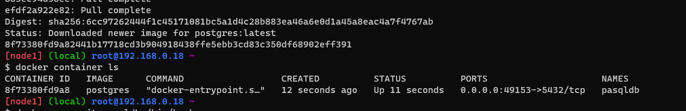
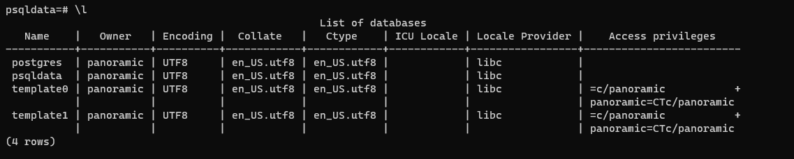
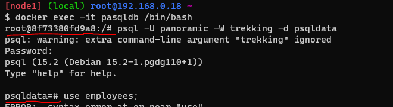
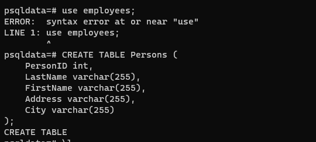
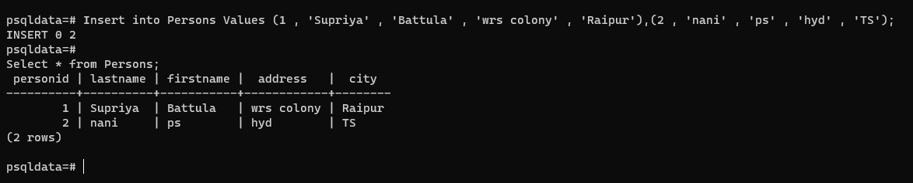
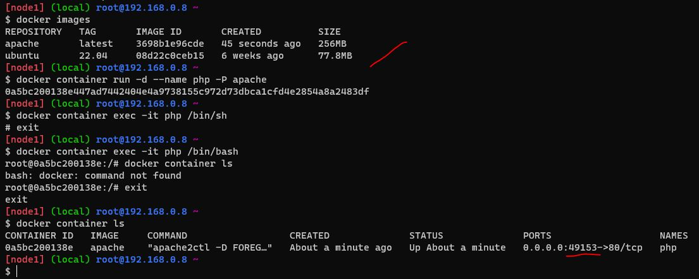
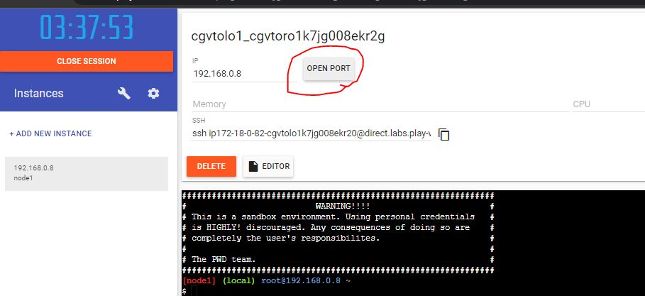
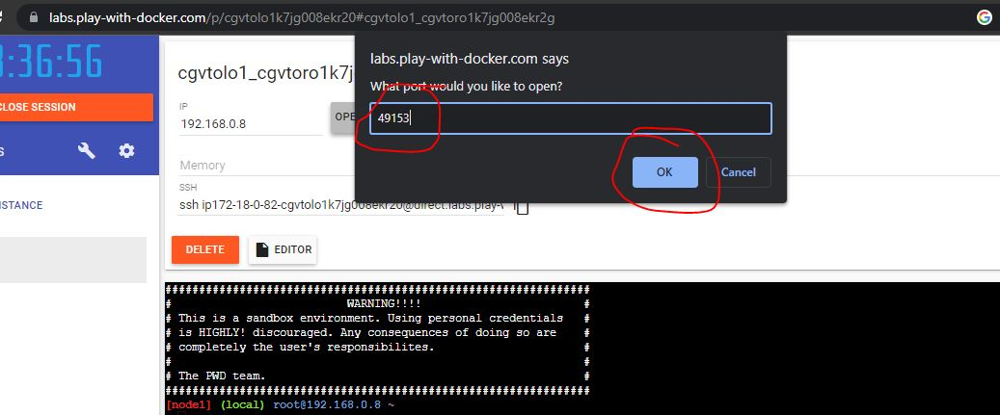
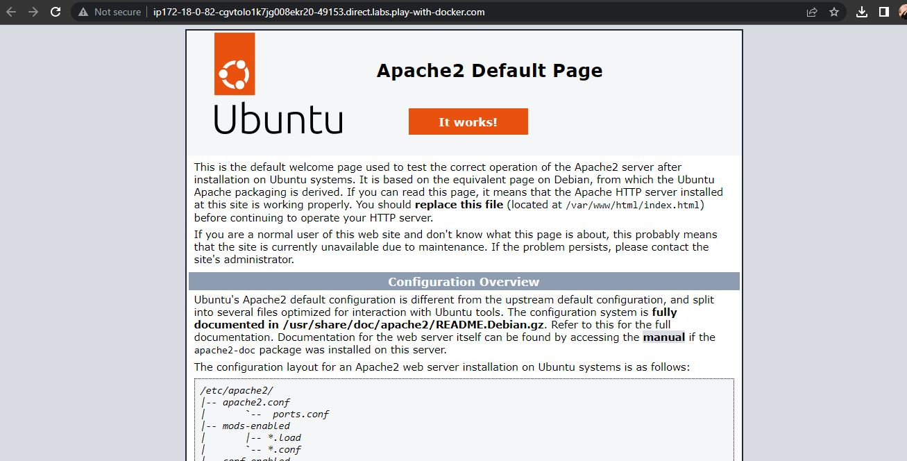

# workbook -2 (pending taks)
3. create an postgres container with user panoramic and password as trekking. Try login in show the database.(query for psql)
* 
```
  $ docker container run -d -P --name pasqldb -e POSTGRES_USER=panoramic -e POSTGRES_PASSWORD=trekking -e POSTGRES_DB=psqldata postgres
  $ docker container ls
  $docker exec -it pasqldb /bin/bash  (root user)
```
* 
* $ \l (long list format. This shows a lot more information presented to the user than the standard command.)
* 
  ```
   $ psql -U panoramic -W trekking -d psqldata
   give password to enter in usre data base
   ```
   
Create a table 
```
$ use employees;
$ CREATE TABLE Persons (
    PersonID int,
    LastName varchar(255),
    FirstName varchar(255),
    Address varchar(255),
    City varchar(255)
);
$  Insert into Persons Values (1 , 'Supriya' , 'Battula' , 'wrs colony' , 'Raipur'),(2 , 'nani' , 'ps' , 'hyd' , 'TS');
$ Select * from Persons;
```
Results


# 4. Try creating a dockerfile which runs phpinfo page,user ARG and ENV whenever appropriate.
* On Apache Server
  * ARG (to biild image)
  * ENV(to create container)
 * $ vi dockerfile
 ```
 FROM ubuntu:22.04
 LABEL author="Supriya" organization="qualitythought"
 ARG DEBIAN_FRONTEND=noninteractive
 RUN apt update && apt install apache2 -y
 RUN apt install php libapache2-mod-php php -y && \
    echo "<? php phpinfo();?>" > /var/www/html/info.php
 EXPOSE 80
 CMD ["apache2ctl","-D", "FOREGROUND"]
 ```
 ```
 $ docker image build -t apache .
 $ docker container run -d --name php -P apache
 $ docker container ls
 ```
 Results
 
 To open port 
 
 
 Apache2 Image
 
Apache 2 php info page
```
FROM ubuntu:22.04
 LABEL author="Supriya" organization="qualitythought"
 ARG DEBIAN_FRONTEND=noninteractive
 RUN apt update && apt install apache2 -y
 RUN apt install php libapache2-mod-php php -y && \
    echo "<?php phpinfo() ?>" >> /var/www/html/info.php
 EXPOSE 80
 CMD ["apache2ctl","-D", "FOREGROUND"]

```


* On Nginx server
 ```
 FROM ubuntu:22.04
 LABEL author="Supriya" organization="qualitythought"
 ARG DEBIAN_FRONTEND=noninteractive
 RUN apt update && apt install nginx -y
 RUN apt install php8.1-fpm -y
 RUN chmod -R 777 /var/www/html
 RUN echo "<? php phpinfo();?>" > /var/www/html/info.php
 RUN systemctl restart nginx
 EXPOSE 80
 CMD ["nginx","-g", "daemon off;"]
 ```
 


