# Docker Workshop-3 Activities (21/APR/2023) - Khaja Sir   
------------------------------------------------------------------------ 

* 1. Create a multi-stage docker file to build  
    a. nop commerce  
  In docker playdroung , login into terminal
  $ vi docker file
  (Docker File)
    ```
    FROM ubuntu:22.04 As builder
    RUN apt update && apt install unzip -y
    ADD https://github.com/nopSolutions/nopCommerce/releases/download/release-4.40.2/nopCommerce_4.40.2_NoSource_linux_x64.zip /nop/nopCommerce_4.40.2_NoSource_linux_x64.zip
    RUN cd nop && unzip nopCommerce_4.40.2_NoSource_linux_x64.zip && rm nopCommerce_4.40.2_NoSource_linux_x64.zip
    FROM mcr.microsoft.com/dotnet/sdk:7.0
    LABEL author="Supriya" organization="qt" project="learning"
    COPY --from=builder /nop /nop-bin
    WORKDIR /nop-bin
    EXPOSE 5000
    CMD [ "dotnet", "Nop.Web.dll", "--urls", "http://0.0.0.0:5000" ]
    ```
    $ docker image build -t nop .
    $ docker container run -d --name nani -P nop
    $ docker container ls
    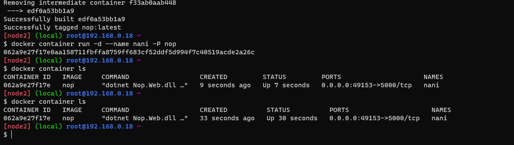
    give port and refresh the page until its work
    Results
    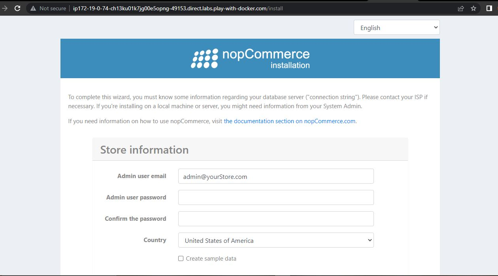

  b. spring petclinic 
  $ vi docker file
  (Docker File)
    ```
    FROM alpine/git AS vcs
    RUN cd / && git clone https://github.com/spring-projects/spring-petclinic.git && \
    pwd && ls /spring-petclinic
    FROM maven:3-amazoncorretto-17 AS builder
    COPY --from=vcs /spring-petclinic /spring-petclinic
    RUN ls /spring-petclinic
    RUN cd /spring-petclinic && mvn package
    FROM amazoncorretto:17-alpine-jdk
    LABEL author="Prakash Reddy" organization="qt" project="learning"
    EXPOSE 8080
    ARG HOME_DIR=/spc
    WORKDIR ${HOME_DIR}
    COPY --from=builder /spring-petclinic/target/spring-*.jar ${HOME_DIR}/spring-petclinic.jar
    EXPOSE 8080
    CMD ["java", "-jar", "spring-petclinic.jar"]
    ```
    after buil the docker file 
    ```
    $ docker image build -t nop .
    $ docker container run -d --name nani -P nop
    $ docker container ls
    ```
    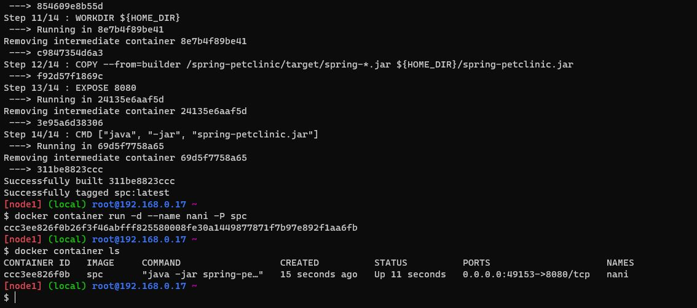
    Results
    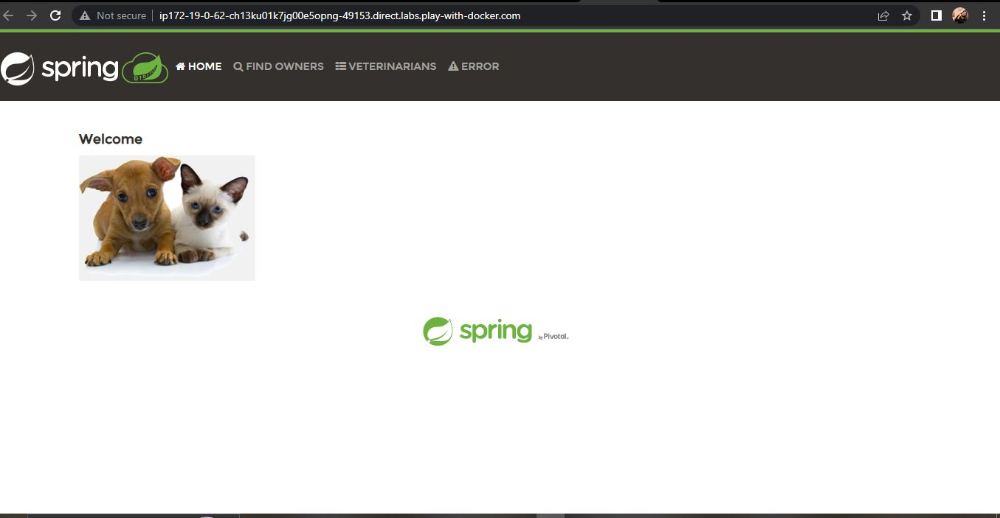

    c. student courses register
      $ vi dockerfile
      ```
      FROM alpine/git AS vcs
      RUN cd / && git clone https://github.com/DevProjectsForDevOps/StudentCoursesRestAPI.git && \
      pwd && ls /StudentCoursesRestAPI
      FROM python:3.8.3-alpine As Builder
      LABEL author="Supriya" organization="qt" project="learning"
      COPY --from=vcs /StudentCoursesRestAPI /StudentCoursesRestAPI
      ARG DIRECTORY=StudentCourses
      RUN cd / StudentCoursesRestAPI cp requirements.txt /StudentCourses
      ADD . ${DIRECTORY}
      EXPOSE 8080
      WORKDIR StudentCoursesRestAPI
      RUN pip install --upgrade pip
      RUN pip install -r requirements.txt
      ENTRYPOINT ["python", "app.py"]
      ```
    ```
    $ docker image build -t scr .
    $ docker container run -d --name nani -P scr
    $ docker container ls
    ```
    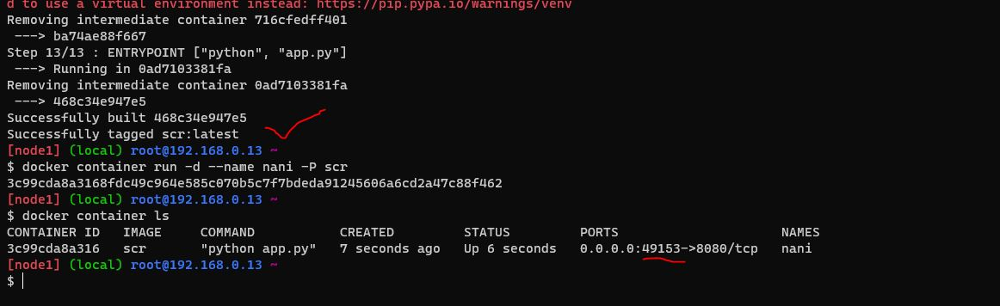
    open the port 
    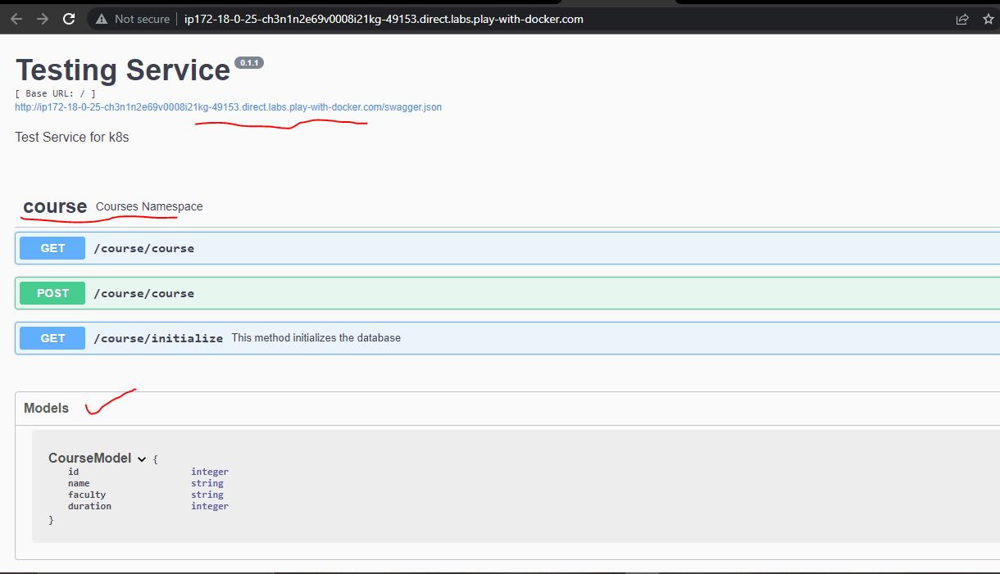
* 2. Push these images to  
      a. Azure ACR
      create a virtual machine and login into a terminal
    * install azure-cli
     * $ sudo apt update
     * $ curl -sL https://aka.ms/InstallAzureCLIDeb | sudo bash
    * $ az --version    (to check version)
    * Now install docker 
    *  $ sudo apt update
    *  $ curl -fsSL https://test.docker.com -o test-docker.sh
    *  $ sh test-docker.sh
    *  $ docker --version (to check version)
      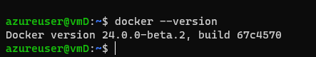
    * $ docker info     (it will not work)
    * $ whoami  (to check present user name)
    * $ sudo usermod -aG docker azureuser
      
    *  $ exit
    * then again login to the machine
    *  $ docker info (docker will run)
    *  login to azure-cli
    *  $ az login
    *  now create ACR (search container registries)
    *  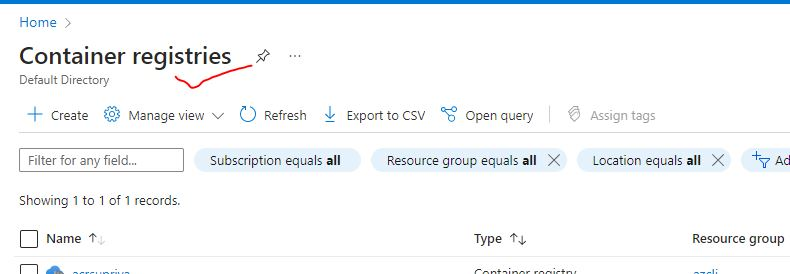
    *  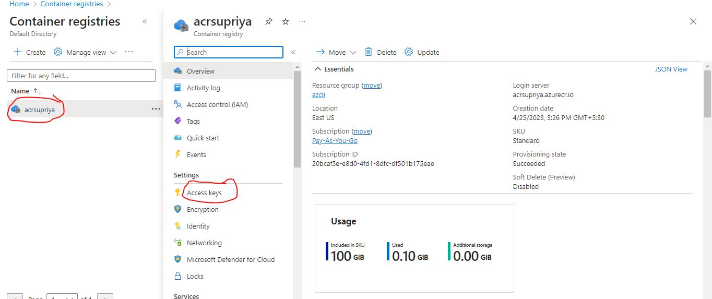
    *  first enable the admin user
    *  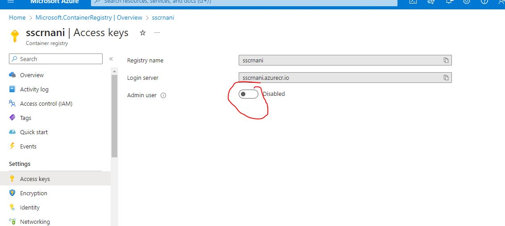
    *  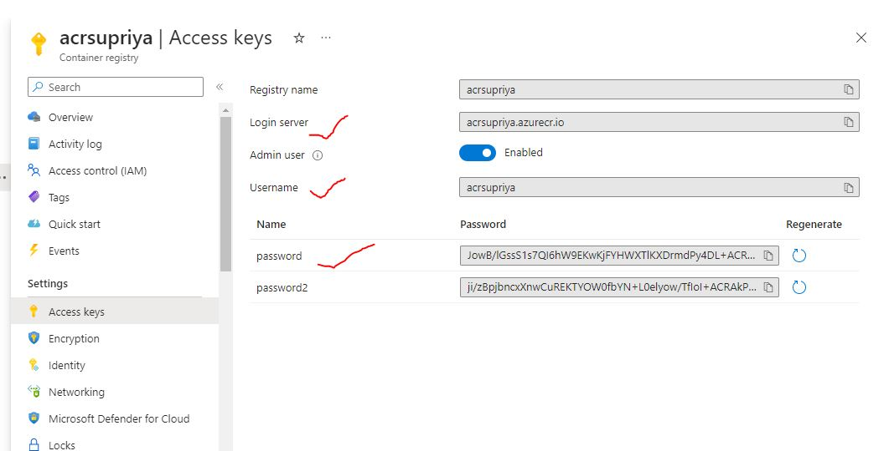
    *  now login into docker 
    *  $ docker login <loginservername>
    *  give the user name and password of ACR
    *  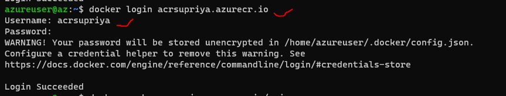
    *  we have login successfully
    *  Now manually we try to push image of nginix
    *  $ docker image pull nginx
    *  $ docker tag <image id> <ACR username>
    *  $ docker tag <image id> <ACR username>/nginx
    *  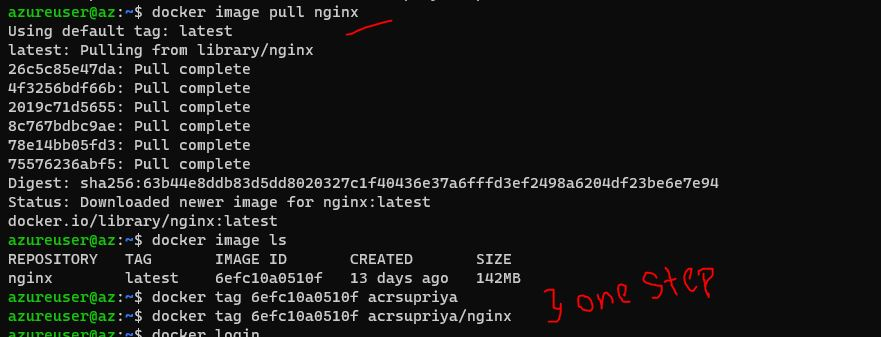
    *  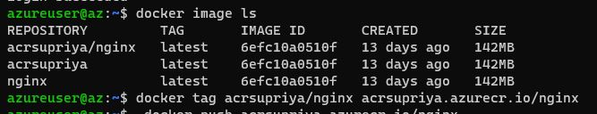
    *  $ docker tag <ACR loginuser>/nginx
    *  now push the image
    *  $ docker push <ACR username>/nginx or docker push <ACR loginuser>/nginx
    *  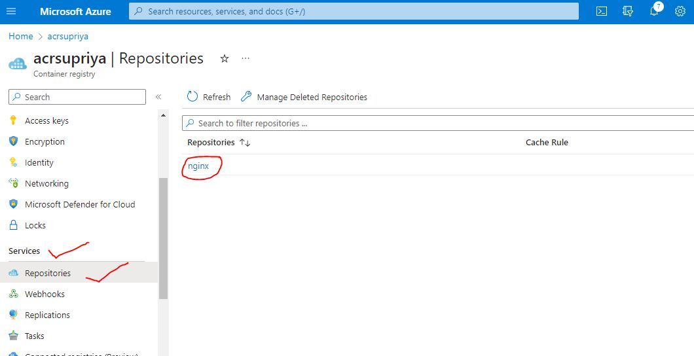
    * Now push the images given below :-
       *  a. student courses register (SCR)
       *  In the same vm create a docker file for scr
       *  $ sudo vi Dockerfile  (write a docker file for scr)
       *  $ docker image build -t scr .
       *  $ docker image ls
       *  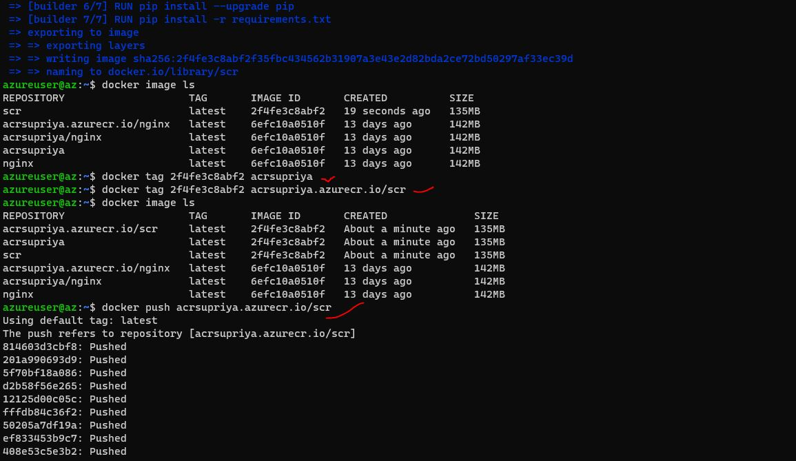
       *  check in the ACR 
       *  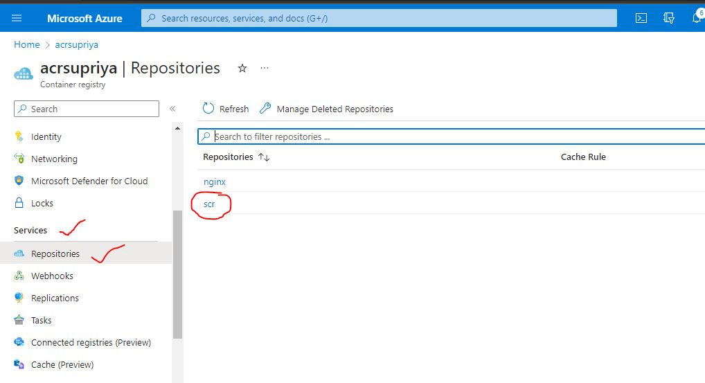

       * b. nop commerce
       * same as previous task (SCR)
       * sudo vi Dockerfile  (write a docker file for nop commerce)
       * docker image build -t nop .
       * docker image ls
       * docker tag <image id> <ACR username>/nop
       * docker tag <ACR loginuser>/nop
       * docker push <ACR loginuser>/nop
       * 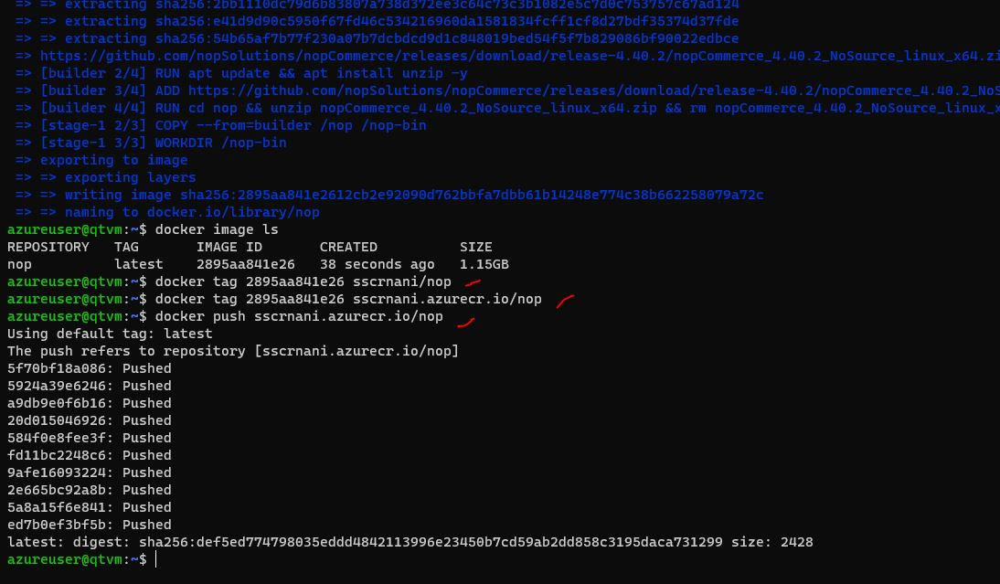
       * check results in the ACR
       *  
       *  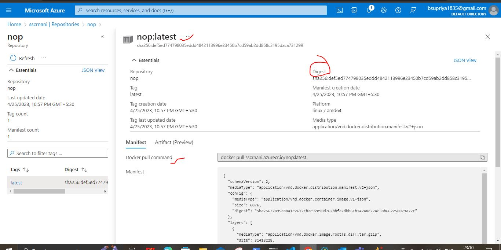
* 3. Write a docker compose file for
    * a. nop commerce
    * Write a docker file for Nop Commerce
    *  $ docker image build -t nop .
    * Write a docker compose file for Nop Commerce
      

      ```
      version: "3.9"
      services:
        nop:
          build:
            context: .
            dockerfile: Dockerfile
          networks:
            - nop-net
          ports:
            - "32000:5000"
          depends_on:
            - nop-db
      
        nop-db:
          image: mysql:8
          networks:
            - nop-net
          volumes:
            - nop-db:/var/lib/mysql
          environment:
            - MYSQL_ROOT_PASSWORD=prakashprakash
            - MYSQL_USER=nop
            - MYSQL_PASSWORD=prakashprakash
            - MYSQL_DATABASE=nop
      volumes:
        nop-db:
      networks:
        nop-net:
      ```
    * To run the docker compose command is <docker compose up -d>
    * To check the docker container creation by using command <docker container ls>
    * 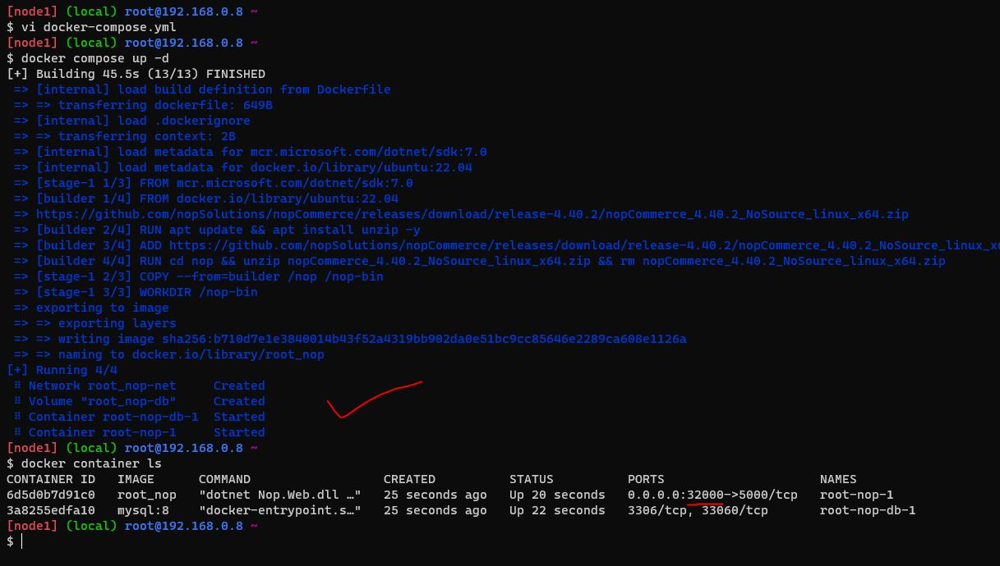
    * To check the nopcommerce web page use the http://<publicip>:32000 (what even you given the opposite port of 32000:5000)
    * 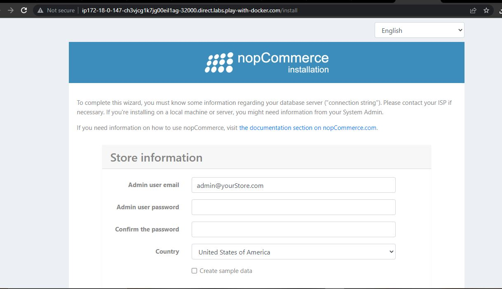


    * b. spring petclinic
    * Create a Dockerfile for Springpetclic application and insert that into vi Dockerfile
    * And then write a docker-compose YAML file for Springpetclic application and insert that into vi Docker-compose.yaml
    * To run the docker compose command is docker compose up -d
```
version: "3.9"
services:
  spc:
    build:
      context: .
      dockerfile: Dockerfile
    networks:
      - spc-net
    ports:
      - "32000:8080"
    depends_on:
      - spc-db

  spc-db:
    image: mysql:8
    networks:
      - spc-net
    volumes:
      - spc-db:/var/lib/mysql
    environment:
      MYSQL_ROOT_PASSWORD: supriya123
      MYSQL_DATABASE: spc
      MYSQL_USER: spc
      MYSQL_PASSWORD:supriya123
volumes:
  spc-db:
networks:
  spc-net:
```   
   * To check the springpetclinic web page use the http://<publicip>:32000 (what even you given the opposite port of 32000:8080)
   * 


   *  c. Student Courses Register
   * Create a Dockerfile for Student Courses Register  application and insert that into vi Dockerfile
    * And then write a docker-compose YAML file for Springpetclic application and insert that into vi Docker-compose.yaml
    * To run the docker compose command is docker compose up -d
```
---
version: "3.9"
services:
  pip:
    build:
      context: .
      dockerfile: Dockerfile
    ports:
      - "30000:8080"
```
  * 


   


