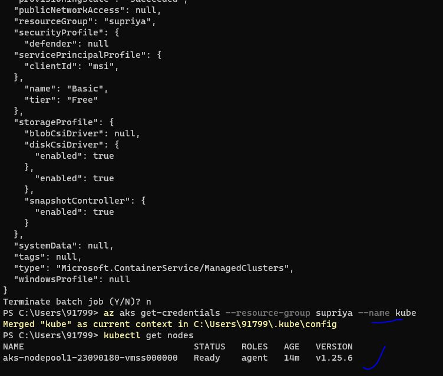
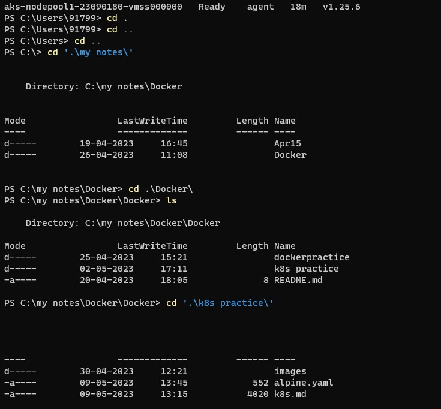
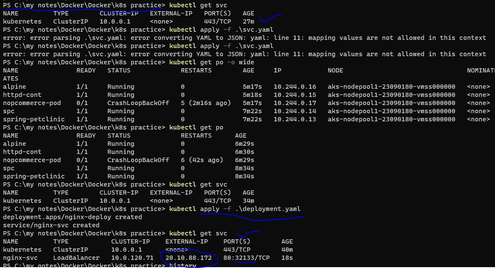
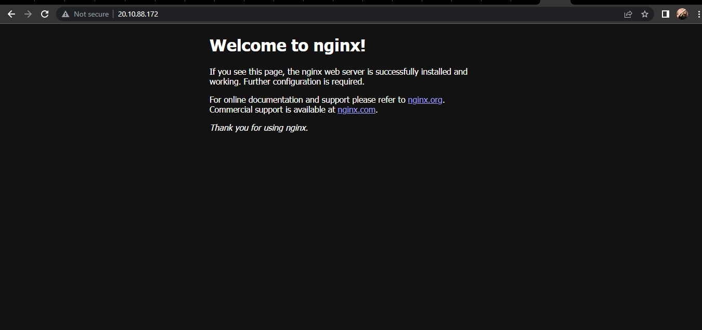

# AKS Cluster 
* -- -----------(to create aks cluster in windows)
   * 1 az login
   * 2 az group create --name supriya --location eastus2
  * 3 az aks create -g supriya -n kube --enable-managed-identity --node-count 1 --enable-addons monitoring --enable-msi-auth-for-monitoring  --ge...
   * 4 az aks install-cli
  *  5 az aks get-credentials --resource-group supriya --name kube
  *  6 kubectl get nodes
   

 *  now change the directory where our yaml files were written
   
* now run the yaml files
```   
  $ kubectl apply -f <yaml file name>
  $ kubectl get svc 
```  
  
  now take the "EXTERNAL-IP: PORT(S)" in new tab
* Results
   