# K8s Installations
 * Single Node Installations
    * minikube
    * kind
 * On-prem installations
   * kube-admin
   * k8s as a Service
   * AKS
   * EKS
   * GKE
 * Playground (for learning): [ref here](https://labs.play-with-k8s.com/)
   # Installing k8s cluster on ubuntu vms
   * Create 3 ubuntu vms which are accesible to each other with atlest 2 vCPUS and 4 GB RAM
   * Installation method (kubeadm) which is something we will be using in on-premises k8s (1 master & 2 nodes).
    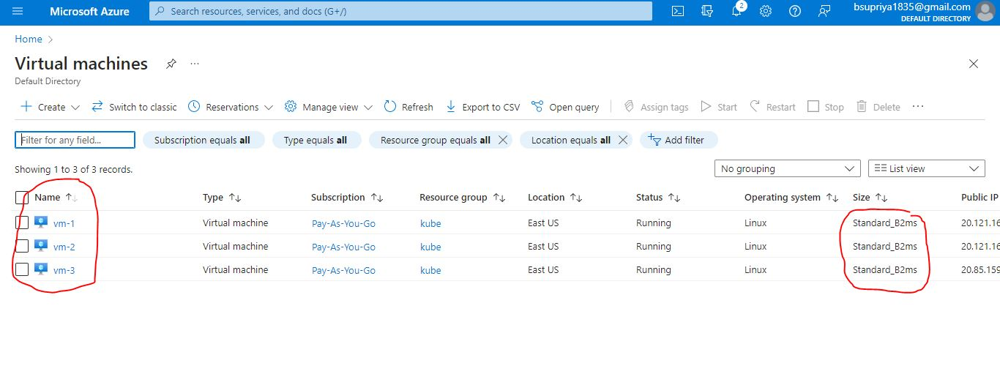
   * vm1(master)
   * vm2(node1)
   * vm3(node2)
   * Install docker on all 3 vm's by using below steps,
```
curl -fsSL https://get.docker.com -o get-docker.sh
sh get-docker.sh
sudo usermod -aG docker ubuntu

```
    * After successful installation re-login into your machine
    * After re-login try to get docker info $ docker info
    * Install CRI-Dockerd [ref here](https://github.com/Mirantis/cri-dockerd)
    * Run the below commands as root user in all the 3 vm's
```
sudo -i
wget https://storage.googleapis.com/golang/getgo/installer_linux
chmod +x ./installer_linux
./installer_linux
source ~/.bash_profile
```
to install cri-dockerd(on Both Master & Nodes)
```
git clone https://github.com/Mirantis/cri-dockerd.git   
cd cri-dockerd
mkdir bin
go build -o bin/cri-dockerd
mkdir -p /usr/local/bin
install -o root -g root -m 0755 bin/cri-dockerd /usr/local/bin/cri-dockerd
cp -a packaging/systemd/* /etc/systemd/system
sed -i -e 's,/usr/bin/cri-dockerd,/usr/local/bin/cri-dockerd,' /etc/systemd/system/cri-docker.service
systemctl daemon-reload
systemctl enable cri-docker.service
systemctl enable --now cri-docker.socket
```
* Now,Installing kubadm, kubectl, kubelet [ref here](https://kubernetes.io/docs/setup/production-environment/tools/kubeadm/install-kubeadm/#installing-kubeadm-kubelet-and-kubectl)
* To Install kobelet,kubectl,kebeadm (on Both Master & Nodes) as Non-root user
```
exit
sudo apt-get update
sudo apt-get install -y apt-transport-https ca-certificates curl
sudo curl -fsSLo /etc/apt/keyrings/kubernetes-archive-keyring.gpg https://packages.cloud.google.com/apt/doc/apt-key.gpg
echo "deb [signed-by=/etc/apt/keyrings/kubernetes-archive-keyring.gpg] https://apt.kubernetes.io/ kubernetes-xenial main" | sudo tee /etc/apt/sources.list.d/kubernetes.list
sudo apt-get update
sudo apt-get install -y kubelet kubeadm kubectl
sudo apt-mark hold kubelet kubeadm kubectl
```
  * Now create a cluster from a master node, use the command <kubeadm init --pod-network-cidr "10.244.0.0/16" --cri-socket "unix:///var/run/cri-dockerd.sock">
  * 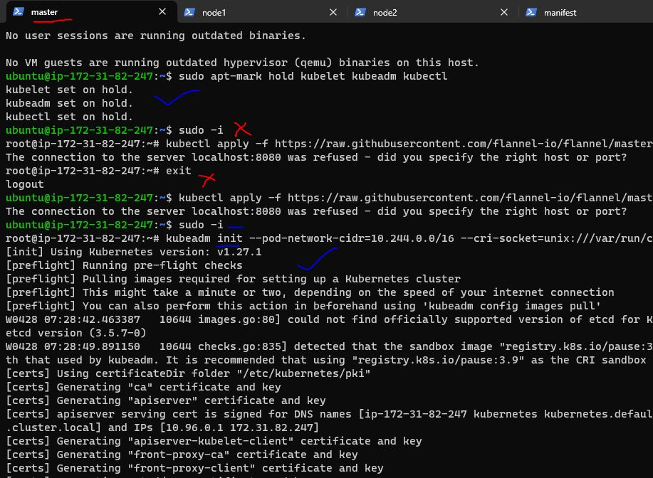
  * To start using your cluster, you need to run the following as a regular user (azure user).<ctrl+d> or logout
  ```
  mkdir -p $HOME/.kube
  sudo cp -i /etc/kubernetes/admin.conf $HOME/.kube/config
  sudo chown $(id -u):$(id -g) $HOME/.kube/config
  ```
  * 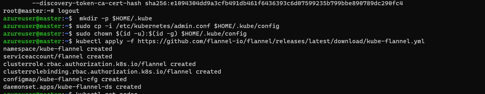
  * to install kube-flannel as a root user
  * <kubectl apply -f https://raw.githubusercontent.com/flannel-io/flannel/master/Documentation/kube-flannel.yml>
  * 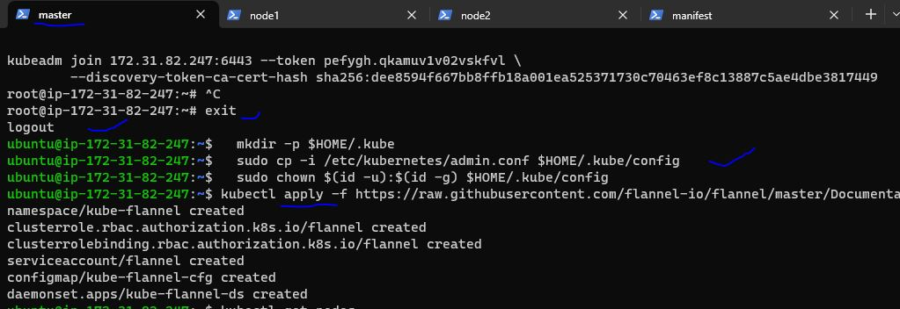
  * Now you need to run the following command in nodes(node1&node2), it will shows on master node.
  * 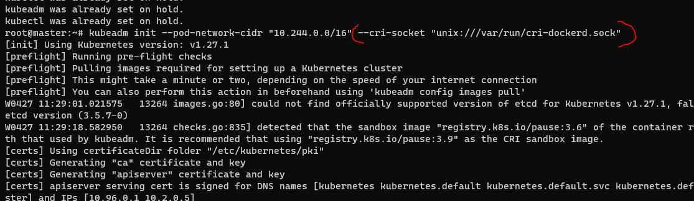
  * 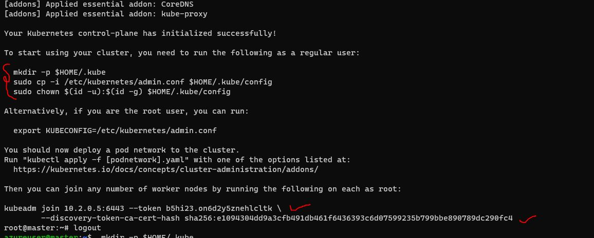
* Joining node to the cluster
* we are including cri-socket to both nodes
  * ```
    kubeadm join 172.31.42.215:6443 --token sioopd.b6i7smx6ydof6ezn \
    --cri-socket "unix:///var/run/cri-dockerd.sock" \
    --discovery-token-ca-cert-hash sha256:3859371f0a4da46619c7775d93855ccf415b277c2ad8e73046ebc4c20f6ef5a5
    ```
 * put those commands in this order in root user only
 * 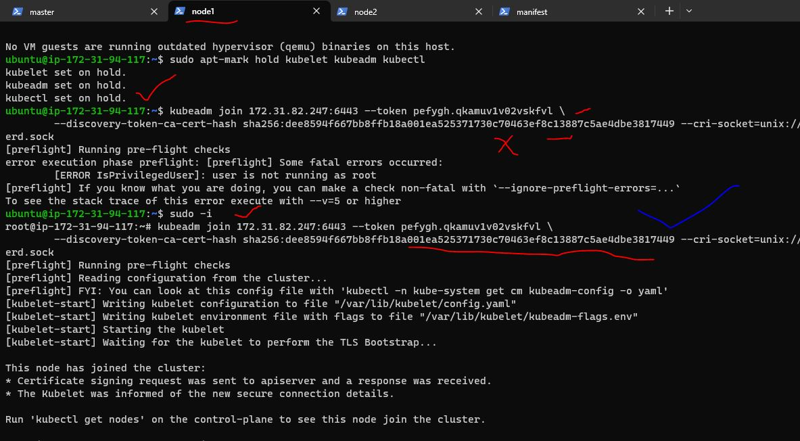
 * 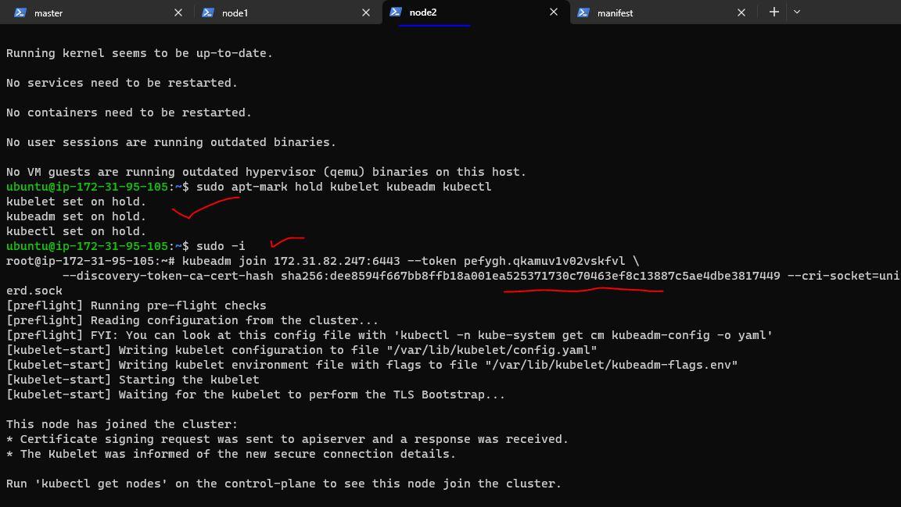
 * Now from manager execute <kubectl get nodes> in master nodes
 * 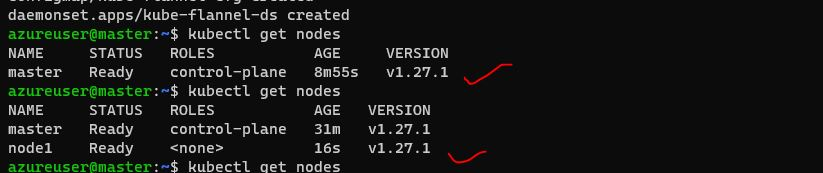
 * Proper Results
 * 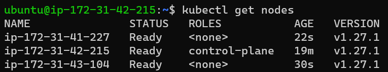
 * 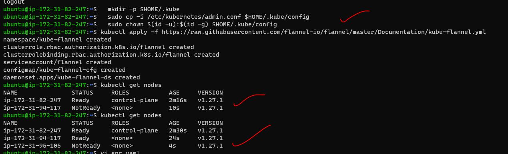
 * Use Docker Cheat Sheet [ref here](https://kubernetes.io/docs/reference/kubectl/cheatsheet/)

vi <file name>.yaml
kubectl apply -f <file name>